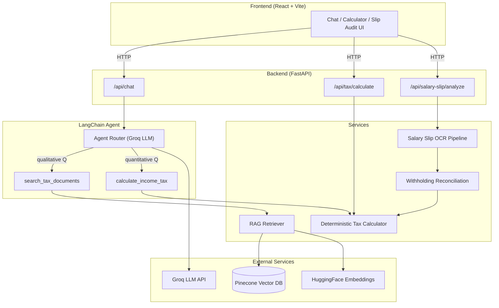

<](https://www.python.org/)
[](https://fastapi.tiangolo.com/)
[](https://react.dev/)
[](https://www.langchain.com/)
[](LICENSE)

</div>

---

TaxSense PK is an AI-powered tax assistant that helps salaried individuals in Pakistan understand their income tax obligations, calculate exact liabilities, and audit employer withholding — all grounded in official FBR (Federal Board of Revenue) statutory documents. It covers Tax Year 2025-26 and Tax Year 2026-27 with source-cited answers and arithmetic that's guaranteed correct by design, not by hoping an LLM can do math.

---

## Why This Isn't Just Another RAG Chatbot

Most AI tax tools fall into one of two traps: either they retrieve legal text and let the LLM hallucinate the math ("your tax is approximately..."), or they build a rigid calculator with no conversational interface. TaxSense PK deliberately avoids both.

The core architectural decision is an **agentic routing layer** that separates two fundamentally different problem types:

| Question type | Routed to | Why |
|---|---|---|
| *"What's the deadline for filing my wealth statement?"* | **RAG document search** (`search_tax_documents`) | Qualitative, procedural — needs retrieval from statutory text with source citations |
| *"How much tax do I owe on PKR 2,800,000?"* | **Deterministic tax calculator** (`calculate_income_tax`) | Quantitative — needs exact slab math, surcharges, and effective rate computation |

The LLM acts as a **router and presenter**, never as a calculator. Tax slab logic is hardcoded from the Finance Act, not retrieved-and-computed. This means:

- **Zero arithmetic hallucination** — slab thresholds, base taxes, marginal rates, and surcharges are encoded as data, not prompt-engineered.
- **Source-grounded legal answers** — qualitative responses cite the exact document and page number from the Income Tax Ordinance or Finance Act.
- **Clean separation of concerns** — the agent decides *what kind of question* it's looking at, then delegates to the right tool. The LLM's job is reasoning about intent and formatting output, not doing math.

---

## Key Features

### Statutory Advisory Assistant
Conversational RAG chat grounded in official FBR documents. Ask about filing deadlines, wealth statement obligations, Section 149 withholding rules, or any procedural question — responses include explicit source citations (`[Source: Finance Act 2026, page 42]`).

### Deterministic Tax Calculator
Exact income tax computation for salaried individuals, covering:
- **TY 2025-26**: 6 slabs + 9% surcharge above PKR 10M
- **TY 2026-27**: 8 slabs, surcharge abolished for salaried individuals

Returns slab range, base tax, marginal rate, tax before surcharge, surcharge (if applicable), total tax, effective rate, and monthly withholding estimate — all computed deterministically.

### Salary Slip Audit
Upload a salary slip (PDF, JPG, PNG) and get an automated withholding reconciliation:
1. **OCR extraction** — dual-pass Tesseract pipeline with adaptive preprocessing (EXIF rotation, dark-border cropping, resolution scaling, contrast enhancement) optimized for both paper scans and smartphone photos of screens.
2. **LLM-assisted field parsing** — structured extraction of gross salary, tax deducted, net pay, and other fields from noisy OCR text.
3. **Confidence validation** — the system independently verifies the LLM's self-reported confidence against how many critical fields were actually populated. Low-confidence extractions trigger a preprocessed retry pass.
4. **Withholding reconciliation** — compares the slip's withheld tax against the deterministic calculator's output, flags mismatches above a 5% threshold, and explains the difference in plain language.
5. **Honest failure mode** — if OCR can't reliably read the document after both passes, the system explicitly says so and recommends manual entry, rather than silently returning unreliable numbers.

### Multi-Turn Conversation Memory
Session-tracked dialogue via session IDs — the agent maintains conversation context across multiple exchanges within a session, enabling follow-up questions like *"What about for tax year 2026-27 instead?"*

---

## Architecture



### Pipeline Details

**Document Ingestion** — Official PDFs are loaded via `PyPDFLoader`, split into 1,000-character chunks with 200-character overlap using `RecursiveCharacterTextSplitter`, embedded with `BAAI/bge-small-en-v1.5` (384-dimensional), and upserted into a Pinecone serverless index.

**Agent Tool-Calling** — The agent is built with LangChain's `create_agent`, given two tools (`search_tax_documents` and `calculate_income_tax`), and a system prompt that enforces strict routing: never estimate tax math, never call the search tool in a loop, always cite sources. The LLM (via Groq) decides which tool to invoke based on the user's question.

**Salary Slip Pipeline** — The `/api/salary-slip/analyze` endpoint accepts file uploads, runs dual-pass OCR (PSM 6 at 1800px Lanczos, then PSM 4 at 1250px Bilinear for screen-captured photos), sends the raw text to the LLM for structured field extraction, validates confidence independently, and feeds the result into the reconciliation engine which compares against the deterministic calculator.

---

## Tech Stack

| Layer | Technology |
|---|---|
| **Language** | Python 3.12+ |
| **Backend Framework** | FastAPI + Uvicorn |
| **LLM Orchestration** | LangChain (agents, tools, retrievers) |
| **LLM Inference** | Groq API |
| **Embeddings** | HuggingFace (`BAAI/bge-small-en-v1.5`) |
| **Vector Database** | Pinecone (serverless, cosine similarity) |
| **OCR** | Tesseract + Pillow + pdf2image + Poppler |
| **Frontend** | React 18 + Vite |
| **Containerization** | Docker |
| **Observability** | LangSmith (optional tracing) |

---

## Data Sources

All statutory data is sourced from official FBR publications:

| Document | Coverage |
|---|---|
| **Income Tax Ordinance 2001** (amended Feb 2026) | Core tax law — definitions, sections, withholding rules, filing obligations |
| **Finance Act 2026** | Latest slab amendments for TY 2026-27, surcharge changes |
| **Income Tax Return e-Filing Guide (Salaried)** | FBR filing procedures and Iris portal guidance |
| **Instructions for Filling in Return Form & Wealth Statement** | Wealth statement requirements and form instructions |

> **Note on slab data**: Tax slab rates and thresholds in `tax_calculator.py` were independently cross-verified against primary source documents (Finance Act 2025 for TY 2025-26, Finance Act 2026 for TY 2026-27) and multiple authoritative secondary sources. The code includes inline comments documenting these sources.

---

## Known Limitations

- **Single-slip income assumption** — The reconciliation engine estimates annual income by multiplying a single month's gross salary by 12. This won't account for mid-year raises, bonuses, or irregular income.
- **No persistent conversation storage** — Conversation history is held in-memory and resets on server restart. Acceptable for a demo; a production deployment would back this with Redis or a database.
- **No authentication** — No user accounts, login, or access control. The API is open.
- **English-only OCR** — Tesseract is configured for English text only. Urdu-language salary slips are not supported.
- **Salaried individuals only** — The calculator covers salaried income tax slabs. Business income, capital gains, and other income types are out of scope.
- **Two tax years only** — Supports TY 2025-26 and TY 2026-27. Future years require manual slab updates.

---

## Setup & Installation

### Prerequisites
- Python 3.12+
- Node.js 18+
- [Tesseract OCR](https://github.com/tesseract-ocr/tesseract) installed and in PATH
- [Poppler](https://poppler.freedesktop.org/) (for PDF-to-image conversion)

### 1. Clone the repository

```bash
git clone https://github.com/magsihassan/taxsense-pk.git
cd taxsense-pk
```

### 2. Set up environment variables

Create a `.env` file in the project root:

```env
GROQ_API_KEY=your_groq_api_key
HF_TOKEN=your_huggingface_token
PINECONE_API_KEY=your_pinecone_api_key
LANGCHAIN_API_KEY=your_langchain_api_key    # optional, for LangSmith tracing
```

### 3. Install backend dependencies

```bash
pip install -r requirements.txt
```

Or with [uv](https://docs.astral.sh/uv/):

```bash
uv sync
```

### 4. Run document ingestion (first time only)

Place the source PDFs in `data/raw_docs/`, then:

```bash
python -m app.ingestion.ingest
```

This chunks the documents, generates embeddings, and upserts them into your Pinecone index.

### 5. Start the backend

```bash
uvicorn app.main:app --reload --port 8000
```

### 6. Install and start the frontend

```bash
cd frontend
npm install
npm run dev
```

The frontend runs at `http://localhost:3000` and expects the backend at `http://localhost:8000`.

### Docker (backend only)

```bash
docker build -t taxsense-pk .
docker run -p 8000:8000 --env-file .env taxsense-pk
```

---

## Disclaimer

TaxSense PK is an **informational tool only**. It is not affiliated with, endorsed by, or connected to the Federal Board of Revenue (FBR) or any government entity. The information and calculations provided are for educational and general guidance purposes and **do not constitute professional tax advice**. Tax laws are subject to change, and individual circumstances vary — always verify with a licensed tax consultant or directly with FBR before making filing decisions.

---

## License

This project is licensed under the [MIT License](LICENSE).

Built as a portfolio and educational project by [Hassan Raza Mir](https://github.com/magsihassan).
]]>
